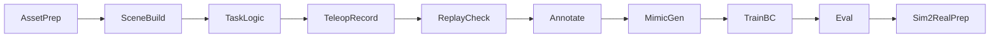

## Shelf-Sim Imitation Learning Pipeline (Isaac Lab + HDF5)

### Idea
Simulate a shelf-stocking task with an Agilex Piper arm, record human teleoperation demonstrations into HDF5, expand them with Isaac Lab Mimic, and train a visuomotor policy (camera + state) that can later transfer to the real robot.

### Why This Approach
- **Visuomotor** keeps training stable (state helps) while still learning from camera images.
- **Mimic** lets a small number of good demos generate a large dataset.
- **Isaac Lab** provides end-to-end teleop -> record -> replay -> annotate -> generate -> train.

### Environment Constraints
- Running in a RunPod container with RTX 4090.
- Isaac Lab is available; Isaac Sim is used through Isaac Lab.
- GUI access is available via KASM VNC (xfce4) when needed.
- Real robot is not available yet; this is sim-first.

>This project is Isaac Lab–only (no Isaac Sim GUI). All validation, teleop, and dataset workflows must run headless or via Isaac Lab scripts (no GUI tools).

### Key Resources
- Teleop + imitation learning: https://isaac-sim.github.io/IsaacLab/main/source/overview/teleop_imitation.html
- Teleop devices: https://isaac-sim.github.io/IsaacLab/main/source/api/lab/isaaclab.devices.html
- Adding sensors: https://isaac-sim.github.io/IsaacLab/main/source/tutorials/04_sensors/add_sensors_on_robot.html
- Camera overview: https://isaac-sim.github.io/IsaacLab/main/source/overview/core-concepts/sensors/camera.html
- Mimic data generation: https://isaac-sim.github.io/IsaacLab/main/source/api/lab_mimic/isaaclab_mimic.datagen.html
- Omniverse USD assets: https://docs.omniverse.nvidia.com/usd/latest/usd_content_samples/downloadable_packs.html
- YCB objects (CC-BY): https://www.ycbbenchmarks.com/object-models/
- Google Scanned Objects (CC-BY): https://research.google/blog/scanned-objects-by-google-research-a-dataset-of-3d-scanned-common-household-items/

---

## Pipeline Overview

---

## Step 1: Asset Sourcing and Import
**Goal:** Gather shelf, table, bin, and 20-30 items with realistic geometry and stable physics.

**Decisions**
- Use Isaac Lab native rigid primitives for shelf/table/bin to keep the scene generic, stable, and easy to randomize.
- Prefer NVIDIA Omniverse USD packs first (fastest integration, already USD).
- Use YCB as the primary non-USD fallback (widely used in manipulation research).
- Avoid Google Scanned Objects unless needed (large download, heavier conversion).

**Actions**
- Start with Omniverse USD asset packs that include shelves, bins, and food items.
  - Recommended packs: Commercial Assets, Industrial Assets, Residential Assets, SimReady Furniture & Misc.
  - These are hosted as USD bundles and integrate directly in Isaac Lab.
- Use Nucleus paths when possible:
  - Isaac Lab exposes `ISAACLAB_NUCLEUS_DIR` for canonical asset paths on Nucleus.
  - Assets can be pulled from Nucleus and cached locally by Isaac Lab utilities.
- For non-USD assets (e.g., YCB meshes), convert with Isaac Lab’s mesh importer:
  - Use `convert_mesh.py` to generate instanceable USD.
  - Set mass and collision approximation (without these, assets are visual-only).
  - Prefer convex decomposition for collisions to avoid tunneling.
- Store all project-owned assets under a stable path (e.g. `projects/assets/`) to keep configs portable.

**Payload limits and item selection**
- AgileX PiPER payload is 1.5 kg (official spec); target <= 1.0 kg per item for stability.
- Suggested grocery-like items to start (10-15 items):
  - cereal box, cracker box, pasta box, rice bag (1 kg), sugar bag (1 kg)
  - soup can, tuna can, mustard bottle, ketchup bottle, peanut butter jar
  - 1L milk carton, bread loaf, banana, apple, orange

**Test/Check**
- Assets load in Isaac Sim, collide properly, and have reasonable scale.
- Each item falls stably into a bin without jitter or explosion.
- Shelf/table/bin are static and do not drift under contact.

**Implementation Steps**

- **Step 1.1**: Piper Arm Validation (`scripts/test_piper_arm.py`)
  - Headless `Articulation` spawn confirmed: fixed base, 8 joints, names match URDF
  - No NaNs in state, stable over 5s (0 drift), joint actuation hit targets within tolerance
  - Result: **PASS** (latest report: `projects/shelf_sim/reports/test_piper_arm_report_20260203_031429.md`)

- **Step 1.2**: Test All 8 USD Items (`scripts/test_assets.py`)
  - Drop each asset into a kinematic bin on a table (headless) to validate collisions and stability
  - Checks: asset spawns, falls, settles (low velocity), and remains inside the bin bounds
  - Writes a concise pass/fail report under `projects/shelf_sim/reports/`

- **Step 1.3**: Combined Scene Test (`scripts/test_scene.py`)
  - Spawn Piper arm + ground plane + dome light + 1 item (e.g., salt_box.usd)
  - Verify scene stable for 5+ seconds, no collisions/explosions
  - Run headless, optionally with GUI for debugging

- **Step 1.4**: Asset Configuration (if needed)
  - Create `config/assets.yaml` to override mass/collision for assets that failed Step 1.2
  - Use `sim_utils.MassPropertiesCfg` and `sim_utils.CollisionPropertiesCfg`

**Execution Order**: `test_piper_arm.py` → `test_assets.py` → `test_scene.py` → Step 1.4 (only if needed)

---

## Step 2: Scene Construction (Shelf + Table + Bin)
**Goal:** Build the physical environment in Isaac Lab.

**Actions**
- Add ground plane, shelf, table, bin, items.
- Create fixed shelf slots as named prims (for target placement).
- Spawn N items in the bin; mark one as the target item.

**Test/Check**
- Simulation runs with no unstable physics.
- Items fall into the bin and rest correctly.

---

## Step 3: Task Definition (Actions, Observations, Success)
**Goal:** Define the learning problem clearly.

**Actions**
- Actions: end-effector delta pose (SE3) + gripper open/close.
- Observations:
  - State: joint positions/velocities, EEF pose
  - Object state: target object pose, target slot pose
  - Camera: RGB (+ optional depth/segmentation)
- Success: target item placed within slot bounds + gripper open.
- Termination: timeout, item falls, major collisions.

**Test/Check**
- Success triggers correctly in a scripted or manual run.

---

## Step 4: Domain Randomization
**Goal:** Avoid overfitting to a single sim layout.

**Actions**
- Randomize per episode:
  - Bin item count and item identities
  - Item poses in bin
  - Shelf occupancy and target slot selection
  - Friction and mass of items
  - Lighting intensity and color
  - Small camera pose jitter and exposure noise

**Test/Check**
- Randomization produces valid scenes without collisions on reset.

---

## Step 5: Camera Integration
**Goal:** Use the camera attached to the arm (or spawn one if missing).

**Actions**
- If camera prim exists in USD: point `CameraCfg.prim_path` to it.
- If it does not exist: spawn a camera attached to the wrist.
- Launch with `--enable_cameras`.

**Test/Check**
- Camera returns RGB frames at expected resolution.

---

## Step 6: Teleoperation and Recording (HDF5)
**Goal:** Record demonstration trajectories.

**Actions**
- Use `record_demos.py` with `--teleop_device keyboard` (or spacemouse).
- Record 10–30 clean demos.
- Use `replay_demos.py` to confirm dataset integrity.

**Test/Check**
- Replays match expected motions.
- Demos are marked as successful in HDF5.

---

## Step 7: Mimic Compatibility (Subtasks)
**Goal:** Enable Mimic to expand the dataset automatically.

**Actions**
- Define subtasks:
  1. Approach target item
  2. Grasp
  3. Lift
  4. Move to shelf
  5. Place and release
- Implement subtask term signals.
- Add Mimic env helpers:
  - `get_robot_eef_pose`
  - `target_eef_pose_to_action`
  - `action_to_target_eef_pose`
  - `actions_to_gripper_actions`
  - `get_object_poses`
  - `get_subtask_term_signals`

**Test/Check**
- `annotate_demos.py` runs without errors.

---

## Step 8: Dataset Generation
**Goal:** Create a large dataset from a small demo set.

**Actions**
- Run `annotate_demos.py` (manual or auto).
- Run `generate_dataset.py` to produce hundreds or thousands of demos.

**Test/Check**
- Generated demos are successful on replay.

---

## Step 9: Train Imitation Policy
**Goal:** Train a BC policy on the generated dataset.

**Actions**
- Use `robomimic/train.py` for BC.
- For visuomotor, enable cameras during training.

**Test/Check**
- Training loss decreases.
- Policy succeeds in simulation with high success rate.

---

## Step 10: Evaluation and Sim-to-Real Prep
**Goal:** Validate before real deployment.

**Actions**
- Evaluate success rate over randomized scenes.
- Stress test with tougher lighting and friction changes.
- Export the policy and record camera calibration data.

**Test/Check**
- Success rate meets target threshold (define early).

---

## Notes for Working in a Container
- GUI tasks (asset inspection, camera view) require KASM VNC.
- Headless is recommended for large-scale dataset generation.
- Datasets can be large; store outside repo if needed.
