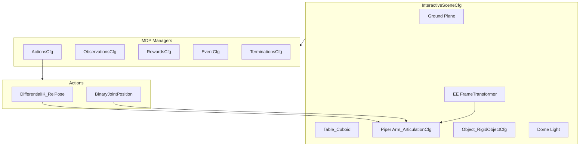

# Shelf Sim: Piper Arm Manipulation Environment

## Current State

The project has been restructured to the correct layout. However, the environment code is still the **cartpole template** from `isaaclab.sh --new` -- it spawns a cartpole, not a Piper arm. The backup scripts in `/bak` are standalone test scripts (not Isaac Lab environments) and should be removed.

**What exists:**

- Piper arm USD at `projects/piper_usd/piper_arm.usd` (1.4KB root + 31MB in `configuration/`) -- already converted from URDF with `fix_base: true`, convex hull colliders, 6 arm joints (`fl_joint[1-6]`) + 2 gripper joints (`fl_joint[7-8]`)
- Cartpole template environment in `source/shelf_sim/shelf_sim/tasks/manager_based/shelf_sim/`
- `robomimic 0.4.0` and `isaaclab_mimic` already installed
- No assets directory (the downloaded assets from `init-repo.sh` are gone)

**What we need:** A working `ManagerBasedRLEnv` with the Piper arm + a graspable object on a table, controlled via IK. We will evolve this to `ManagerBasedRLMimicEnv` in a later step once the basics work.

---

## Step 1: Create a Piper Arm Robot Config

Isaac Lab has no built-in Piper config. Create one at `source/shelf_sim/shelf_sim/robots/piper.py`, following the exact pattern from [isaaclab_assets/robots/franka](file:///opt/IsaacLab/source/isaaclab_assets/isaaclab_assets/robots/franka/__init__.py).

**Key decisions:**

- Use the local USD at `projects/piper_usd/piper_arm.usd` (absolute path via `os.path.abspath`)
- Two actuator groups: `arm_joints` (fl_joint[1-6]) and `gripper_joints` (fl_joint[7-8])
- Two configs: a standard PD config and a high-PD config (for IK tracking)
- `fix_base: true` is already baked into the USD

**Reference pattern** from `bak/test_scene.py` (lines 456-489):

```python
ArticulationCfg(
    spawn=sim_utils.UsdFileCfg(
        usd_path=str(usd_path.resolve()),
        rigid_props=sim_utils.RigidBodyPropertiesCfg(
            disable_gravity=False,
            max_depenetration_velocity=5.0,
        ),
        articulation_props=sim_utils.ArticulationRootPropertiesCfg(
            enabled_self_collisions=False,
            solver_position_iteration_count=8,
            solver_velocity_iteration_count=0,
        ),
    ),
    actuators={
        "arm_joints": ImplicitActuatorCfg(
            joint_names_expr=["fl_joint[1-6]"],
            effort_limit_sim=100.0,
            velocity_limit_sim=3.0,
            stiffness=10000.0,
            damping=100.0,
        ),
        "gripper_joints": ImplicitActuatorCfg(
            joint_names_expr=["fl_joint[7-8]"],
            effort_limit_sim=10.0,
            velocity_limit_sim=1.0,
            stiffness=500.0,
            damping=50.0,
        ),
    },
)
```

---

## Step 2: Rewrite the Environment Config

Replace the cartpole template in [shelf_sim_env_cfg.py](projects/shelf_sim/source/shelf_sim/shelf_sim/tasks/manager_based/shelf_sim/shelf_sim_env_cfg.py) with a Piper arm manipulation scene. Follow the pattern from Isaac Lab's `lift_env_cfg.py`.

**Scene** (`ShelfSimSceneCfg`):

- Ground plane
- Table (cuboid, kinematic, at z=0.75)
- Piper arm (from our custom config, positioned behind the table)
- Object (a simple cuboid or cylinder -- we start with a primitive, not a USD asset, to keep it simple)
- Dome light
- End-effector frame sensor (`FrameTransformerCfg`) tracking the Piper gripper tip

**Actions** (`ActionsCfg`):

- `arm_action`: `DifferentialInverseKinematicsActionCfg` with `use_relative_mode=True` (delta EEF pose) -- this is what teleop will later feed into
- `gripper_action`: `BinaryJointPositionActionCfg` for open/close

**Observations** (`ObservationsCfg`):

- Joint positions and velocities
- Object position relative to robot root
- EEF position (via frame transformer)

**Events** (`EventCfg`):

- `reset_all`: Reset scene to default
- `reset_object_position`: Randomize object pose on the table

**Rewards** (`RewardsCfg`) -- minimal for now, just enough for the random agent to run:

- `reaching_object`: EEF-to-object distance reward
- `action_rate`: Small penalty on action rate

**Terminations** (`TerminationsCfg`):

- Timeout
- Object falls off table

**Critical detail**: The Piper gripper end-effector body name must match a link in the USD. From the previous test scripts, this is likely the last link in the chain. We will need to discover the exact body name from the USD -- the plan accounts for this with a quick introspection step.

---

## Step 3: Update MDP Module

Replace the cartpole-specific reward in [mdp/rewards.py](projects/shelf_sim/source/shelf_sim/shelf_sim/tasks/manager_based/shelf_sim/mdp/rewards.py) with manipulation-relevant reward functions.

For now, import everything from `isaaclab.envs.mdp` (already done in `mdp/__init__.py`) and add custom rewards as needed. The built-in `isaaclab.envs.mdp` already provides:

- `joint_pos_rel`, `joint_vel_rel`, `joint_vel_l2`
- `last_action`, `action_rate_l2`
- `reset_scene_to_default`, `reset_root_state_uniform`
- `time_out`, `root_height_below_minimum`

For manipulation-specific terms (like `object_ee_distance`, `object_position_in_robot_root_frame`), we can reference the lift task's MDP or write our own.

---

## Step 4: Update Gym Registration

Update [init.py](projects/shelf_sim/source/shelf_sim/shelf_sim/tasks/manager_based/shelf_sim/__init__.py) to:

- Register the environment as `ShelfSim-Piper-Lift-v0` (replacing `Template-Shelf-Sim-v0`)
- Remove the `rsl_rl_cfg_entry_point` (no longer using RL)
- Point to the new `ShelfSimEnvCfg`

---

## Step 5: Verify with Random Agent

Run the existing `scripts/random_agent.py` with the new environment to confirm everything loads and runs:

```bash
/opt/IsaacLab/isaaclab.sh -p projects/shelf_sim/scripts/random_agent.py \
  --task ShelfSim-Piper-Lift-v0 --num_envs 1 --headless
```

This validates:

- The Piper arm loads and physics is stable
- IK controller solves without errors
- The object spawns on the table
- Observations and actions flow correctly
- No NaN explosions

---

## Architecture Diagram




---

## Key Files Changed


| File                                                        | Action                                          |
| ----------------------------------------------------------- | ----------------------------------------------- |
| `bak/*`                                                     | Delete                                          |
| `source/shelf_sim/shelf_sim/robots/__init__.py`             | New -- exports Piper configs                    |
| `source/shelf_sim/shelf_sim/robots/piper.py`                | New -- `PIPER_ARM_CFG`, `PIPER_ARM_HIGH_PD_CFG` |
| `source/shelf_sim/shelf_sim/tasks/.../shelf_sim_env_cfg.py` | Rewrite -- Piper arm + table + object           |
| `source/shelf_sim/shelf_sim/tasks/.../mdp/rewards.py`       | Rewrite -- manipulation rewards                 |
| `source/shelf_sim/shelf_sim/tasks/.../mdp/__init__.py`      | Update -- add new mdp terms                     |
| `source/shelf_sim/shelf_sim/tasks/.../__init__.py`          | Update -- new gym registration                  |
| `source/shelf_sim/shelf_sim/tasks/.../agents/__init__.py`   | Keep empty for now                              |


